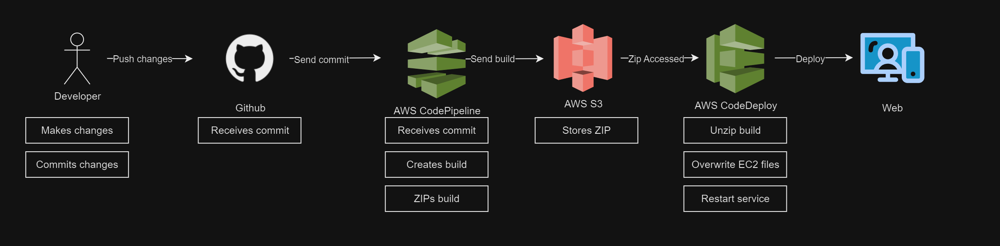

# Pipeline Documentation for Anon-Images

## Overview
This document outlines the CI/CD pipeline for the Anon-Images application, detailing the automated processes for integration and deployment, ensuring efficient and reliable application updates.

## Pipeline Structure

- **Source Control**: GitHub
  - Commits to the main branch trigger the pipeline.

- **Continuous Integration**: AWS CodePipeline
  - Detects changes on push to GitHub.
  - Executes the following stages:
    - Pre-build: `npm install`
    - Build: `npm run build`
    - Artifact creation: Includes `frontend/build/**/*`, `appspec.yml`, and `scripts/**/*`.

- **Continuous Deployment/Delivery**: AWS CodeDeploy
  - Deploys files from the S3 bucket.
  - Overwrites existing files.
  - Restarts the frontend PM2 service with the new files.

### Pipeline Diagram


## Prerequisites
- Proper AWS IAM roles and permissions set for EC2 to interact with CodeDeploy and CodePipeline.

## Setup Instructions
1. Clone the repository:
   ```sh
   git clone https://github.com/Syte1/cloud-project-photo-app.git
   ```
## Deployment Process
- **Trigger**: A `git push` to the main branch.
- **Build steps**:
  - Install dependencies with `npm install`.
  - Build the application using `npm run build`.

## Maintenance and Troubleshooting
Perform regular checks of AWS CloudWatch logs for monitoring and identifying potential issues.

## Contact and Support
For questions or support, contact:
- **Belal Kourkmas**
  - Email: [belalkourkmas@gmail.com](mailto:belalkourkmas@gmail.com)

## Change Log
- **11/13/2023**: Initial creation of the pipeline documentation.
